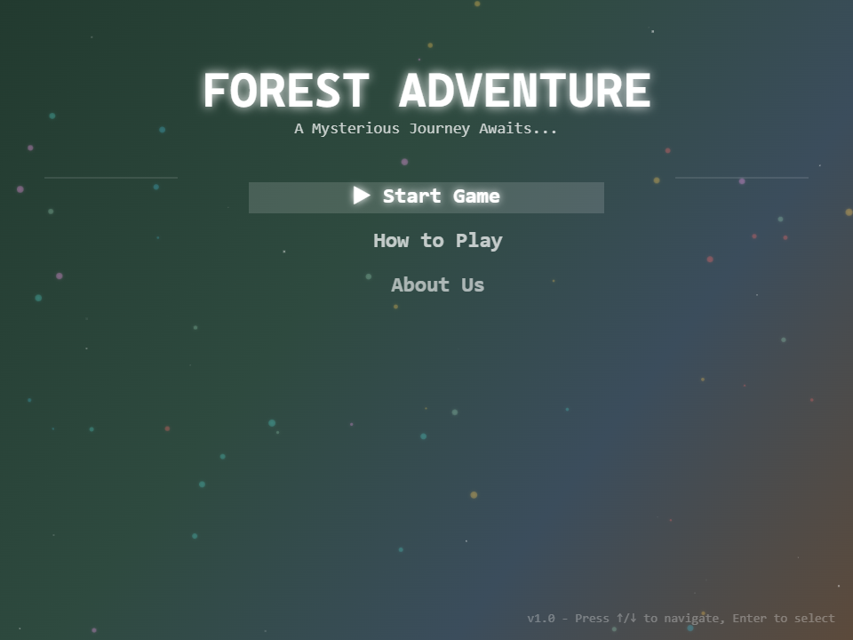
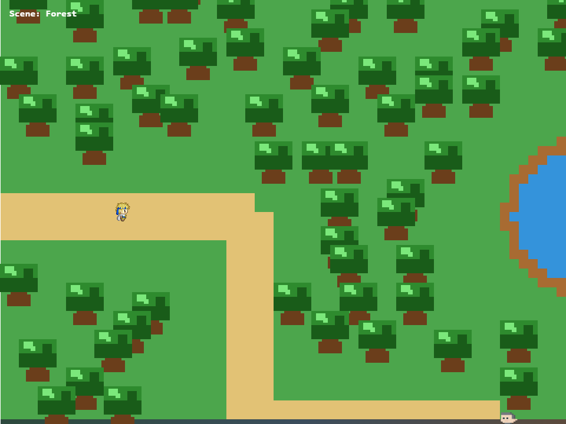
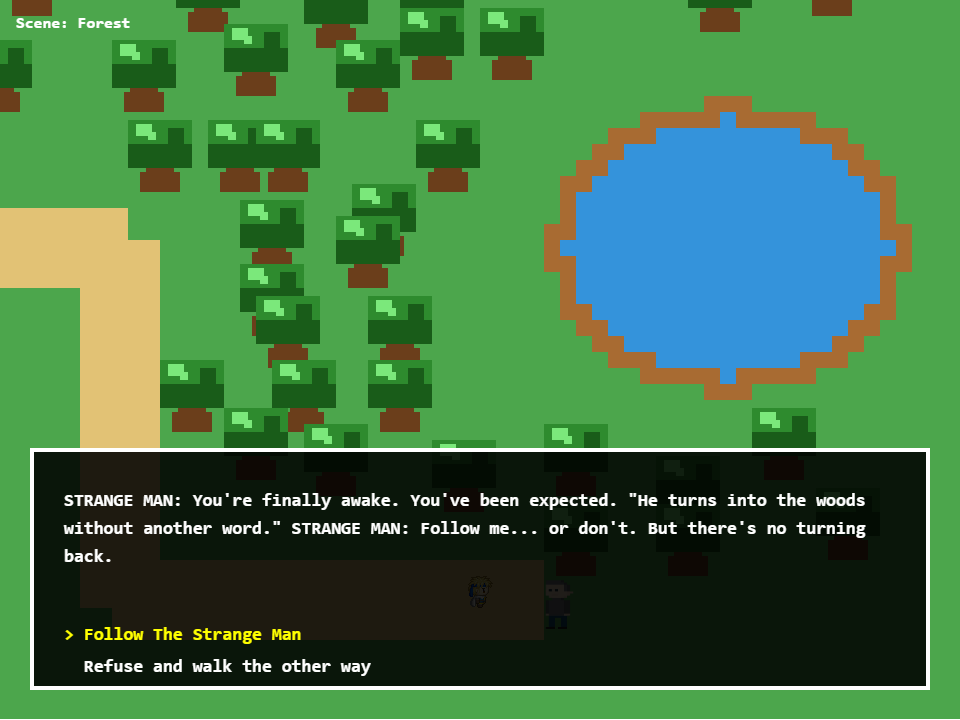
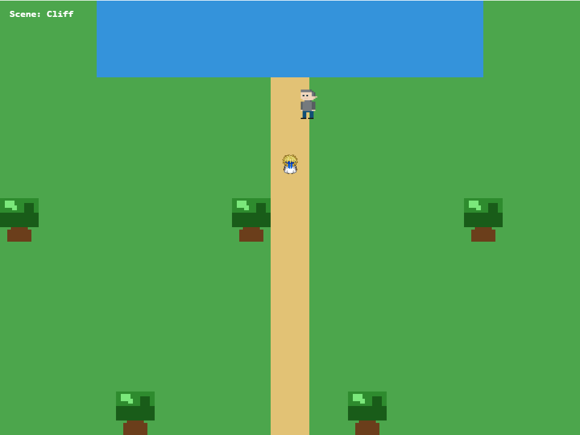

# Forest Adventure

A top-down pixel game about a forest that keeps the people who walk into it. You wake at the edge of the woods, a stranger is waiting, and every answer you give opens a different path.

This is a front-end university project. Open the page in a browser and it runs.

## Screenshots

<p align="center">
  
  
</p>
<p align="center">
  
  
</p>

## About the game

A legend says the forest was once alive with memory. People who wandered in came back different, if they came back at all. Your journey starts on that edge, deciding whether to follow the strange man or trust your gut and walk the other way.

From there the woods branch. You can end up in a deeper stretch of forest, an abandoned temple, a sea shore, a cave, an abandoned house, or a cliff. There is no single correct route. Some choices get you out. Others do not.

When a story ends, the game shows the path you took. You can save that summary as an image.

## How to play

Open `index.html` in a modern browser. On the title screen, use the arrow keys to move the highlight and Enter to select **Start Game**. The game asks for a name and an age, then plays a short introduction. Any key continues once the text has settled.

Walk the path, stay off the water and the tree trunks, and talk to the people you meet.

### Controls

| Action | Keys |
| --- | --- |
| Move | Arrow keys |
| Talk to a character or a sign | Space |
| Move between dialogue choices | Up / Down |
| Confirm a choice | Enter |
| Finish dialogue text immediately | Space or Enter |
| Leave a conversation | Escape |
| Reset your position in the current scene | R |

### Menus and endings

| Screen | Keys |
| --- | --- |
| Title menu | Up / Down to move, Enter to select |
| Name and age | Type to enter, Backspace to delete, Enter to confirm |
| Introduction | Any key to continue |
| After an ending | Space to return to the menu, Enter to download your path as a JPG |
| How to Play and About Us | Any key to go back |

## Built with

The game is a single HTML page. JavaScript draws the world, characters, menus, and dialogue on one HTML canvas. CSS centers that canvas and keeps the pixel art sharp.

| Piece | What it does |
| --- | --- |
| HTML5 | Page, canvas, and script tags |
| CSS | Centers the canvas and uses pixelated image rendering |
| JavaScript | Game loop, input, scenes, dialogue, and endings |
| Canvas 2D | All drawing, including tiles, sprites, and text |
| Pixel sprites | Player, Strange Man, and Local Woman |

The scripts load in this order: `player_sprite.js`, `local_woman.js`, `strange_man.js`, then `game.js`.

## Project structure

```
index.html          Page and canvas
style.css           Layout
game.js             World, scenes, dialogue, and endings
player_sprite.js    Player sprite
strange_man.js      Strange Man sprite
local_woman.js      Local Woman sprite
screenshots/        Images used in this README
```
